# Features

A tour of what tsmap does. For step-by-step instructions on any of this, see the
[user guide](user-guide.md) — this page covers capability and benefit, not the click-by-click.

## Open any format

STDF, ATDF, CSV, JSON, and Parquet — all multi-wafer by default, and all mergeable into one
gallery from several files at once. Gzip (`.gz`) and Zip (`.zip`) archives are handled
transparently.

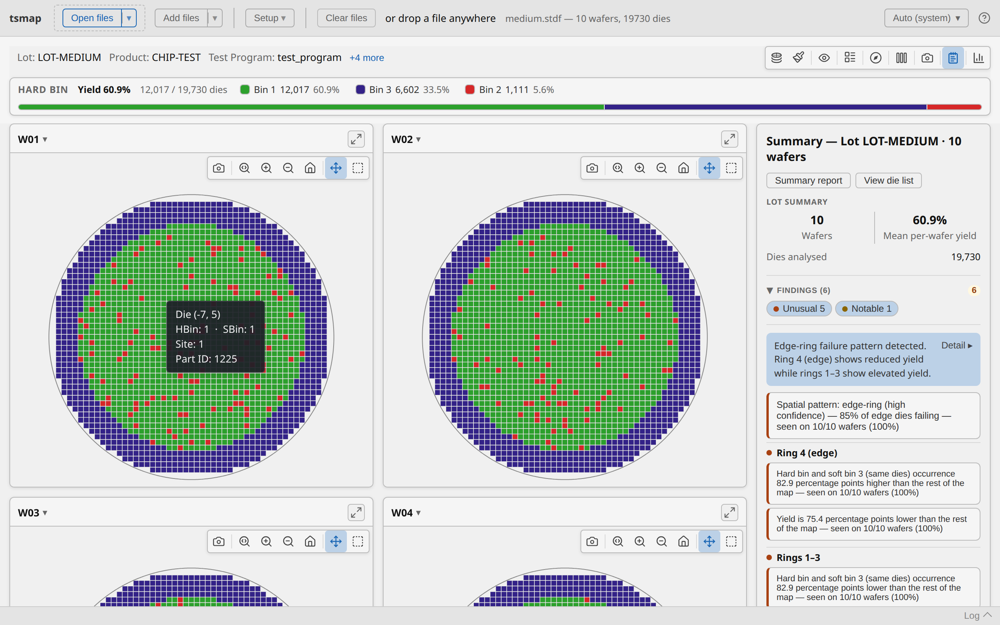

STDF and ATDF are parsed natively in Rust on both platforms (compiled to WebAssembly for the
browser), which is where tsmap's speed comes from: a 341 MB / 266,000-die STDF lot parses in
about 3.5 seconds (~96 MB/s) on a 2021 ThinkPad laptop, and about 2.3 seconds (~148 MB/s) on
a small desktop. CSV and ATDF parsing saw similar jumps in a 2026 rewrite — CSV about 3.4×
faster, ATDF about 2.8× faster.

See [Supported file formats](user-guide.md#1-supported-file-formats) and
[Opening files](user-guide.md#2-opening-files) in the user guide.

## Find the right files before you open them

Pointed at a directory of hundreds of lots, **Filter files…** reads only each file's header
metadata — lot ID, part type, tester, job name, wafer count, start and finish times, site
count — and lays them out as one row per file. Sort, filter per column, or search across all
of them, then load just the subset you actually want; the rest are never parsed. A filter can
be saved and reloaded, so a recurring selection is a file rather than a habit. Because the
scan skips die and test records entirely, it stays quick over a large batch.

## Two-pass test selector

STDF/ATDF files with a lot of tests get a fast first-pass scan, then a selector overlay to
choose which tests to actually import — before the full parse runs. Selections (and renames)
can be saved to a file and reloaded later, or supplied on the command line.

See [Test selector](user-guide.md#4-test-selector-stdf-and-atdf) in the user guide.

## Interactive wafer maps

Yield, soft-bin, and per-test parametric heat-map views, with zoom, pan, and hover. Spatial
findings (edge effects, clustering) are always computed; an optional value-findings mode adds
statistical outlier detection on top.

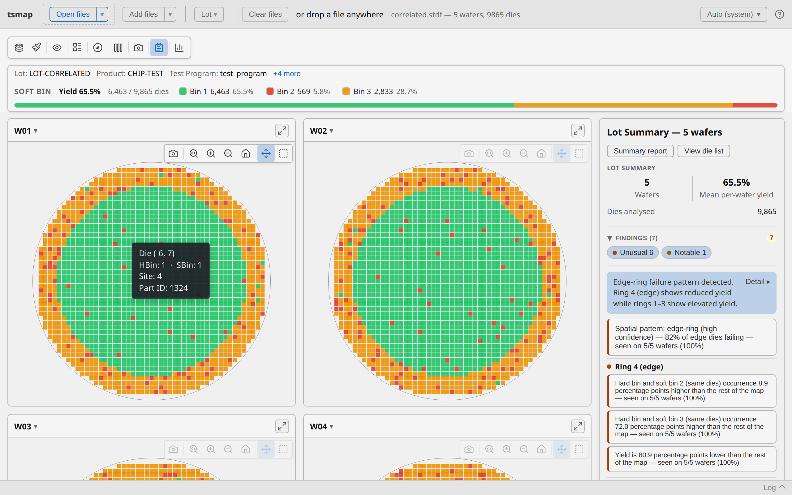

See [The wafer map view](user-guide.md#5-the-wafer-map-view) in the user guide.

### Dies with no reported position

X/Y position is optional in every format. A wafer with no reported position never renders as
a fabricated map — showing dies at synthetic positions risks being misread as real spatial
data. Instead it shows a compact summary that follows the current plot mode — a bin breakdown
in the map's own colours for hard/soft-bin modes, or a histogram (also colour-matched, and
log-scale/spec-range aware like the map's colorbar) for value mode — with a one-click toggle
to the full die list when you need exact values or CSV export. A wafer that's only
partly positioned renders its map for the dies that do have coordinates, plus an expandable
"+N dies without position data" footer offering the same chart/die-list toggle for the rest. Yield,
bin counts, and per-test statistics still count every die either way — only spatial findings
(edge ring, quadrants, clustering) are scoped to positioned dies. A lot-wide combined die
list, also CSV-exportable, is available from the toolbar's **Lot ▾** menu for any
multi-wafer load.

See [Dies with no reported position](user-guide.md#51-dies-with-no-reported-position) in the
user guide.

## Wafer splits — compare process corners

Attach an arbitrary label to each wafer — a process corner (TT/FF/SS/FS/SF), an experiment
group, anything not present in the source file — and save/load the assignment as CSV. Splits
feed straight into every chart's **Group by** control.

See [Wafer splits](user-guide.md#6-wafer-splits) in the user guide.

## Charts & Insights

The Insights tab (wafermap's own built-in chart suite) covers yield, bin pareto, process
capability, boxplot, histogram, correlation matrix, and scatter — organized into Overview,
Distributions, and Correlation sub-tabs, with a shared **Group by** control (lot, program,
tester, node, part type, or any wafer split) and click-through drilldown.

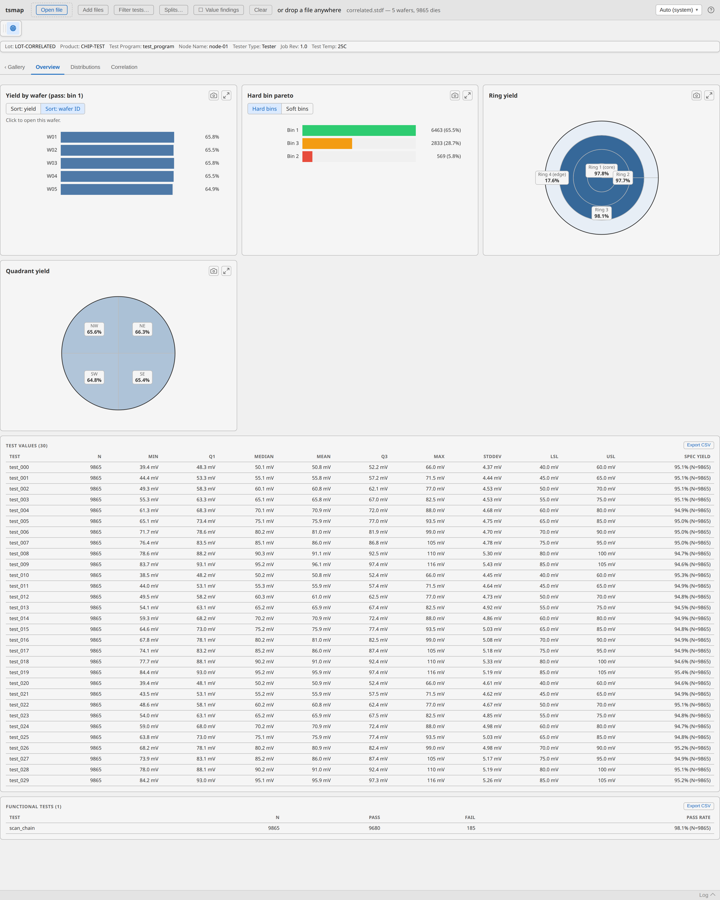

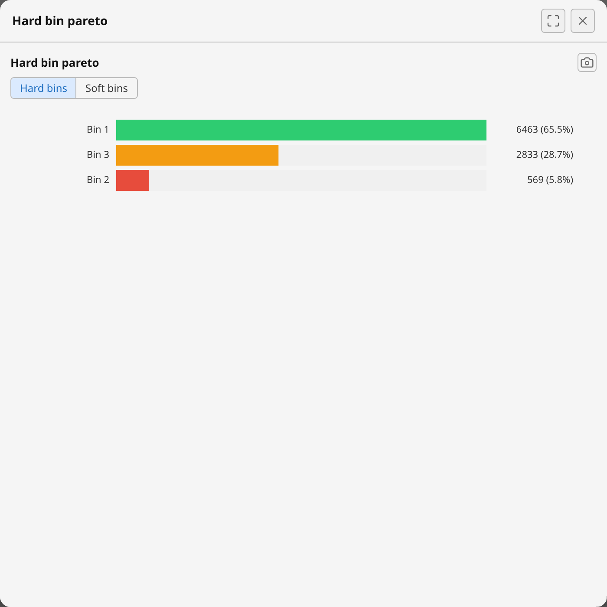
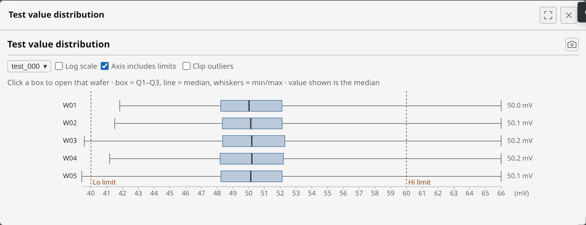

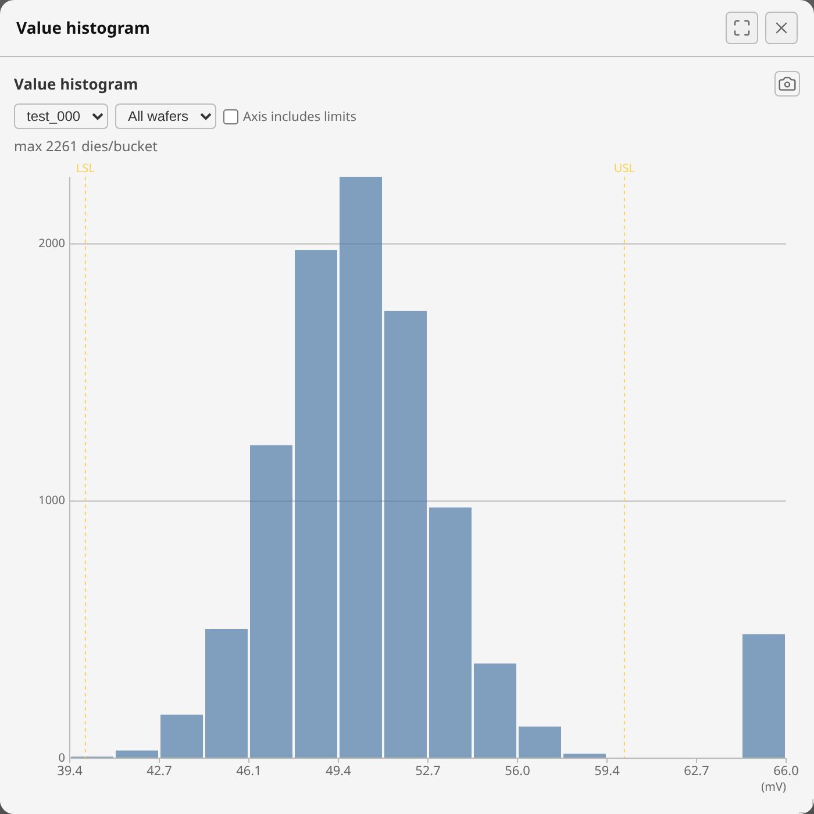
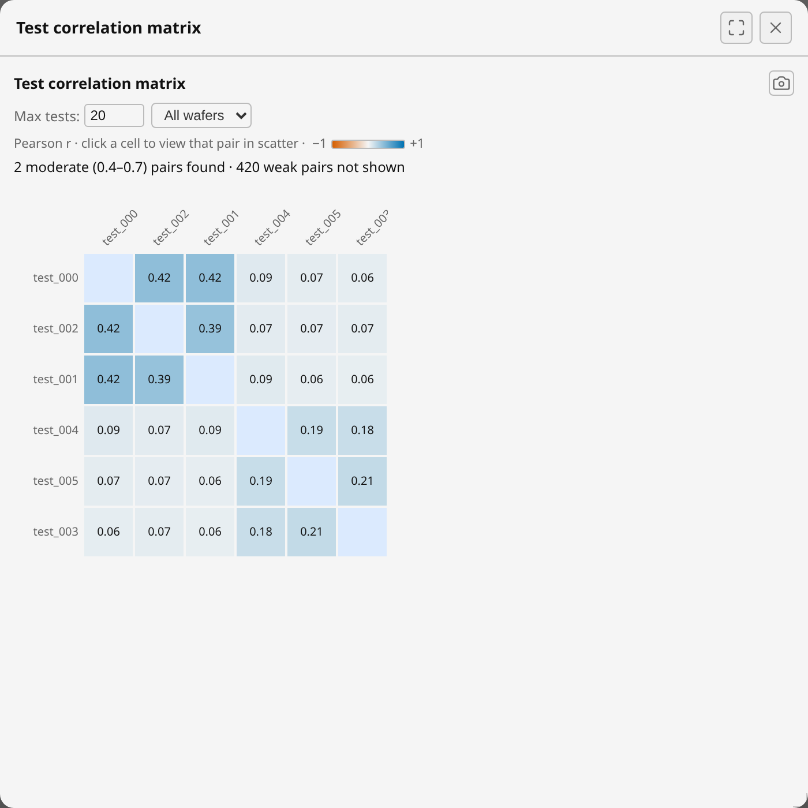
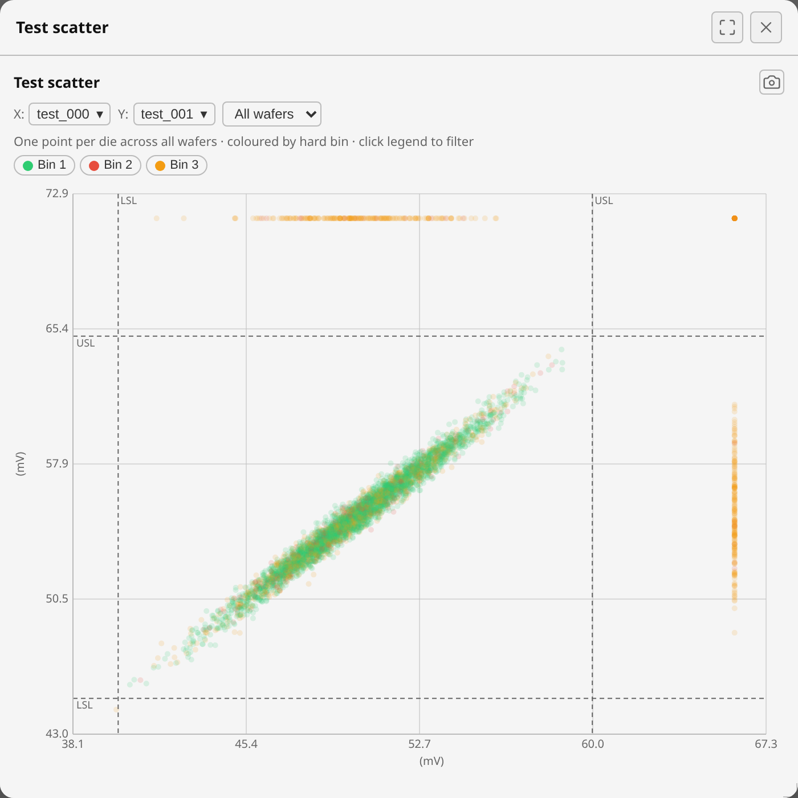

Grouping and drilldown work together: group the Overview by a wafer split to see yield and
bin pareto broken out per corner, then click a group's bar to drill in-place to that corner's
own per-wafer view.

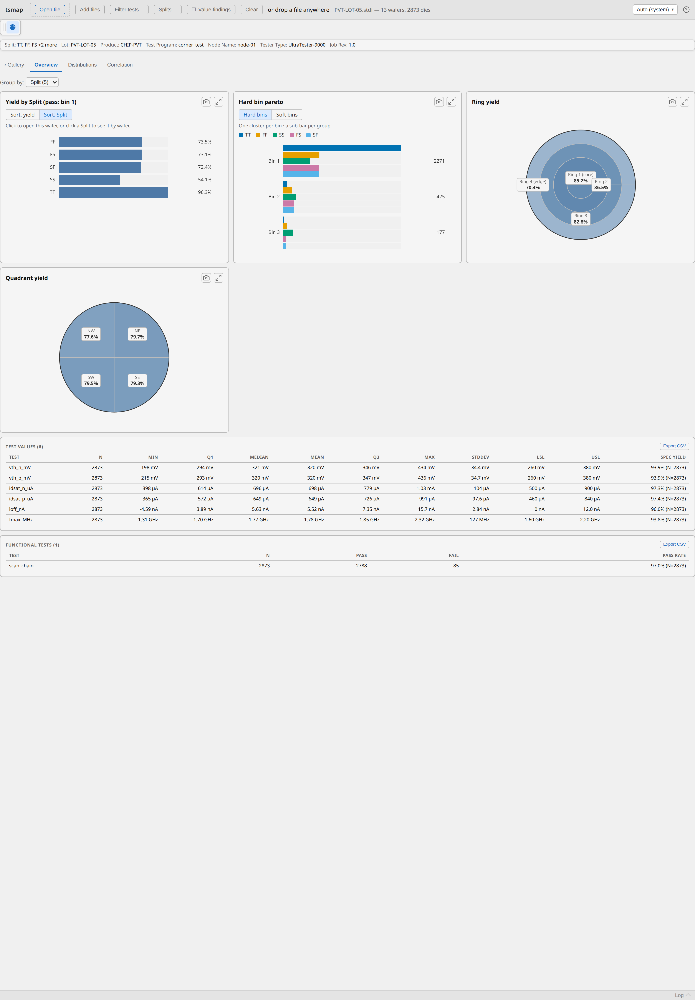
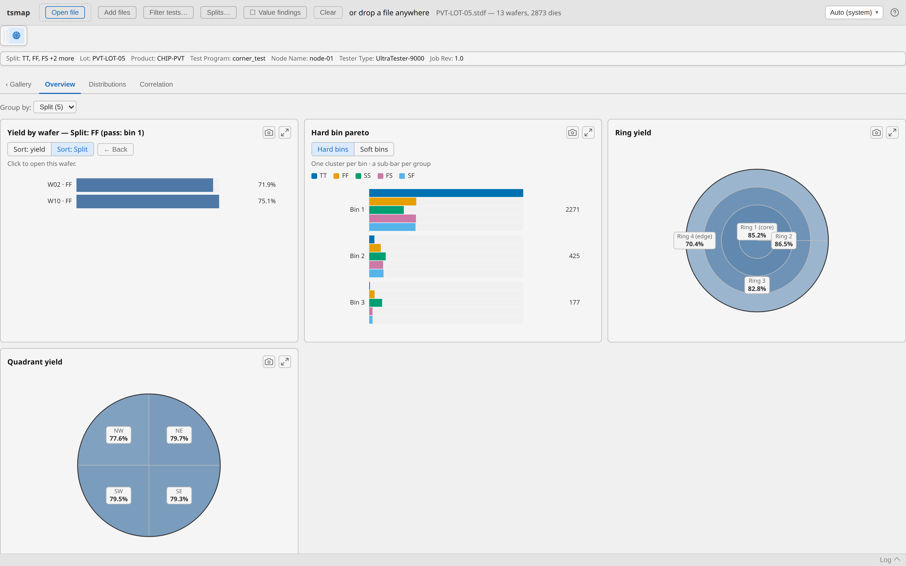

See [Insights tab](user-guide.md#7-insights-tab) in the user guide.

## Export & desktop/browser parity

Every chart has a camera button for a clean PNG export at full resolution, and the wafer map
toolbar has its own PNG export too. The desktop app and browser build share the same Rust
parsing core and the same rendering — same maps, same charts, both fully local and both
usable offline once loaded.

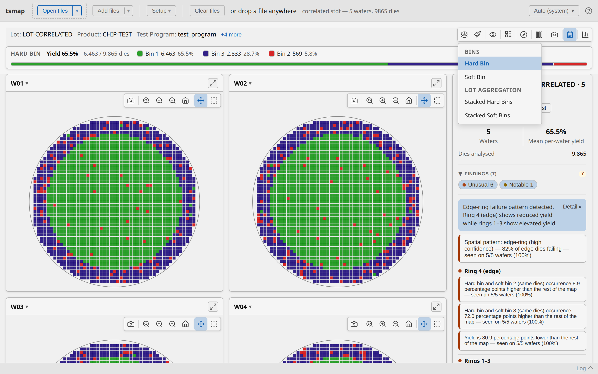

See [Exporting charts](user-guide.md#8-exporting-charts) and the full
[desktop vs browser comparison](web.md#differences-from-the-desktop-app) in the web app page.

## Open directly from your own systems

A caller application — your own data-selection page, a script, a scheduled task — can hand
tsmap a URL and have it fetch and load the data itself, no manual download/upload step for the
user. On desktop: `tsmap --url <url> --url-format <format>`, or a `tsmap://open?url=...&format=...`
link that launches the installed app straight from a web page click. In the browser:
`?dataUrl=&dataFormat=` as a query param on the app's own URL. Desktop also supports
`--url-headers <file>` for data APIs that authenticate via a header rather than a
self-authenticating link.

Once a file is associated with tsmap (**Help → File associations…**, desktop only), double-clicking
a `.stdf`/`.atdf`/`.parquet` file in a file manager opens it in tsmap directly — an in-app setting,
changeable anytime, rather than something locked in at install.

See [Opening data from a URL](user-guide.md#opening-data-from-a-url) and
[File associations](user-guide.md#file-associations-desktop) in the user guide, and the full
[integration guide](integrating-data-selection.md) for architecture options (presigned URLs,
a download proxy, same-origin SSO) if you're wiring this up against your own data API.
