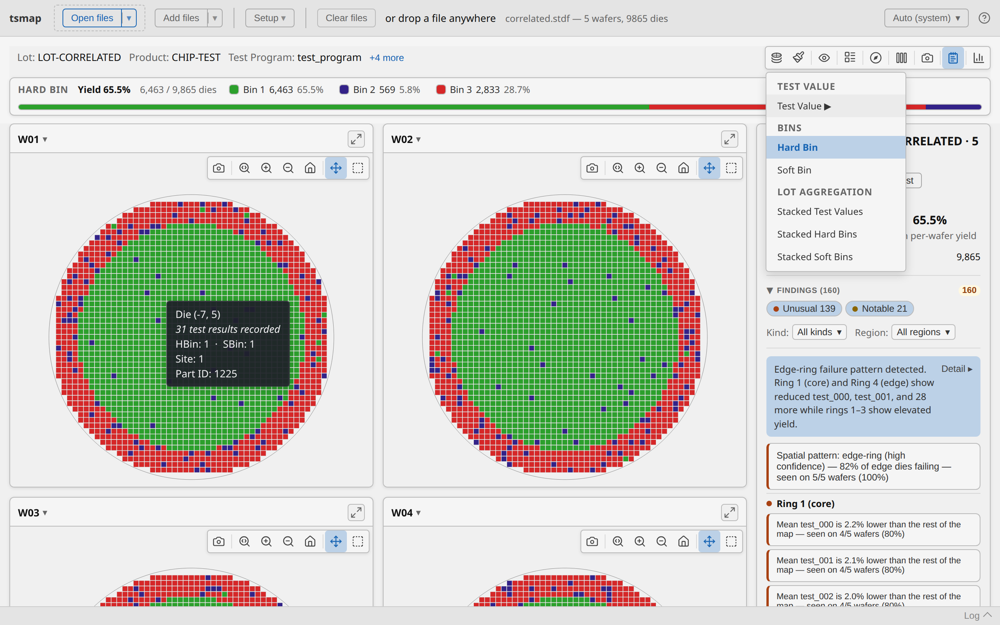
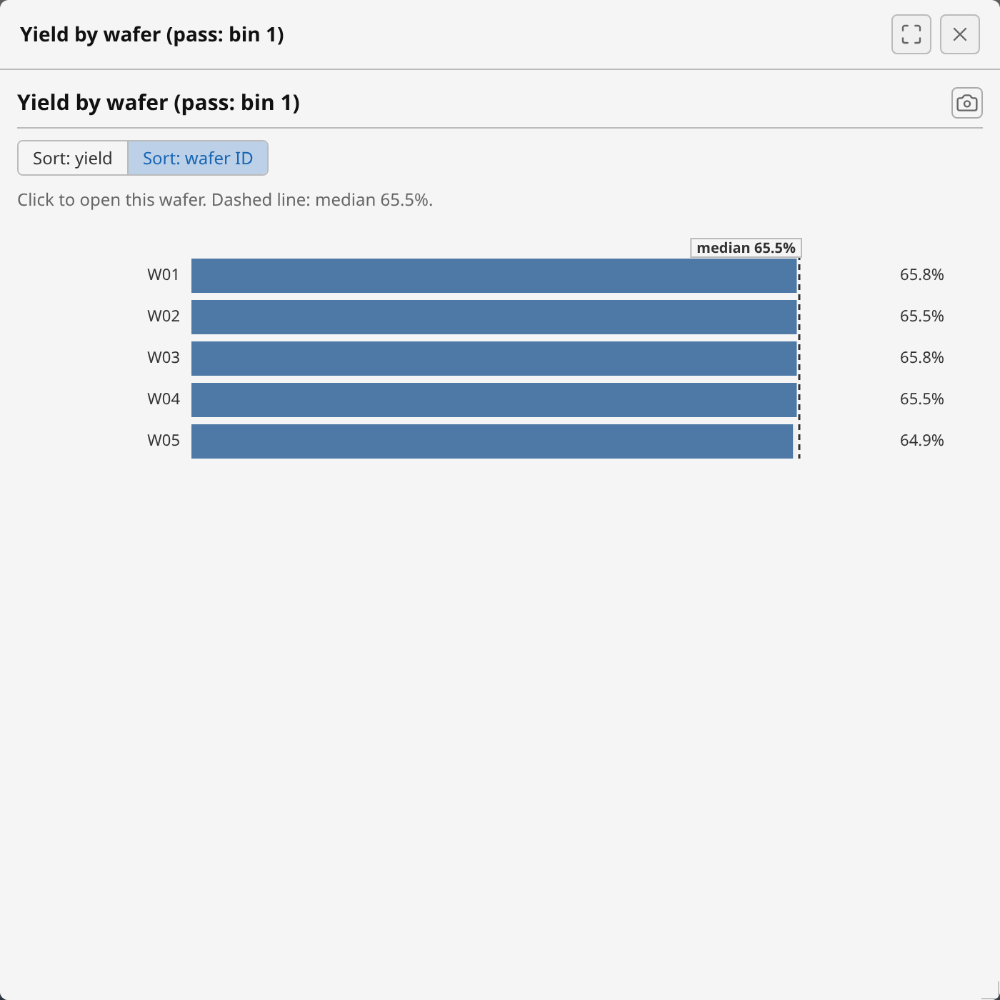

---
hide:
  - navigation
  - toc
---

# tsmap

A desktop and browser application for loading and visualising semiconductor wafer map data.
Open STDF, ATDF, CSV, JSON, and Parquet lot files and get interactive yield maps, parametric
heat maps, bin pareto charts, per-test boxplots and histograms, and a cross-test correlation
matrix — all without uploading your data anywhere. Wafer rendering and analysis are built
on [wafermap](https://wafertools.github.io/wafermap/), our own purpose-built wafer-map engine.

> **Building your own tool?** The rendering and analysis engine is available separately as
> **[wafermap](https://wafertools.github.io/wafermap/)** (`@wafertools/wafermap` on npm) —
> the same maps, findings and charts, embeddable in your own application. Use tsmap to
> *look at* wafer data; use wafermap when you need wafer maps *inside* something you are
> building.

## Why tsmap

- **Fast.** The parser is native Rust on both platforms — a 341 MB / 266,000-die STDF lot
  parses in about 3.5 seconds (~96 MB/s) on a 2021 ThinkPad laptop, or about 2.3 seconds
  (~148 MB/s) on a small desktop.
- **One engine, two platforms.** The desktop app and the browser build share the same Rust
  parsing core (compiled to WebAssembly for the browser) and the same rendering — what you
  see in one, you see in the other.
- **Nothing leaves your machine.** Parsing happens entirely locally, on both desktop and
  browser. There is no upload step.
- **Lean.** Seven runtime dependencies, total. No bundled UI framework, no third-party
  charting library.

## Try it in the browser

**[Open tsmap →](app/index.html)**

No install required. Files are parsed locally in your browser using a WebAssembly build of
the same Rust parser used in the desktop app. Nothing is uploaded.

No wafer files of your own? [Download a sample lot](web.md#try-it-with-sample-data) and open
it straight away.

## Download the desktop app

The desktop version adds native file dialogs, drag-and-drop from the OS, and works offline
without a browser. Builds for Linux, macOS, and Windows are attached to each
[GitHub release](https://github.com/wafertools/tsmap/releases).

## Host it yourself

Can't reach the public internet, or not allowed to open lot data on an external site? The
browser version is also published as a static bundle — `tsmap-<version>-web.zip` on the same
[release page](https://github.com/wafertools/tsmap/releases/latest). Unpack it into any web
server and browse to it: no installer, no server-side component, and no internet access
needed at any point. Files are still parsed in the browser, so nothing reaches your server
either.

See [Hosting tsmap on your own server](web.md#hosting-tsmap-on-your-own-server).

## See it in action

<a href="features.md#interactive-wafer-maps" style="flex:1; min-width:200px;">
 
Interactive wafer maps
</a>
<a href="features.md#wafer-splits-compare-process-corners" style="flex:1; min-width:200px;">
 
Compare process corners with splits
</a>
<a href="features.md#charts-insights" style="flex:1; min-width:200px;">
 
Charts &amp; Insights
</a>

See the full [Features](features.md) tour, or read through a few [Use cases](use-cases.md).

Have a data-selection app of your own? Try the **[live demo of opening tsmap from a
link](demos/open-from-link.html)** — pick a sample dataset and launch it into the browser
build or the desktop app with a single URL.

## Supported formats

| Format | Notes |
|--------|-------|
| STDF (`.stdf`, `.std`) | Binary V4 — multi-wafer lots, PTR and FTR tests; test selector always shown |
| ATDF (`.atdf`, `.atd`) | ASCII equivalent of STDF |
| CSV (`.csv`, `.txt`, `.dat`) | Column mapping step; wide and long (pivot) formats |
| JSON (`.json`) | Flat array or nested `[{ wafer, results: [{die}] }]` |
| Parquet (`.parquet`) | Columnar, typed; same column mapping step as CSV/JSON, with a type-mismatch hint. `snappy`/`gzip`/`lz4`/`brotli` on both platforms; `zstd` on desktop only |
| Gzip (`.gz`) | Transparent decompression — e.g. `lot.stdf.gz` |
| Zip (`.zip`) | All contained files extracted and loaded as a batch |

## Community

Questions, ideas, or want to show off a wafer map you built? Use [GitHub Discussions](https://github.com/wafertools/.github/discussions).

## Links

- [Web app](app/index.html)
- [Demo: open tsmap from a link](demos/open-from-link.html)
- [Features](features.md)
- [Use cases](use-cases.md)
- [Tutorial: analyse your first wafer lot](tutorial.md)
- [User guide](user-guide.md)
- [Troubleshooting](troubleshooting.md)
- [GitHub](https://github.com/wafertools/tsmap)
- [Releases](https://github.com/wafertools/tsmap/releases)
- [wafermap library](https://wafertools.github.io/wafermap/)
