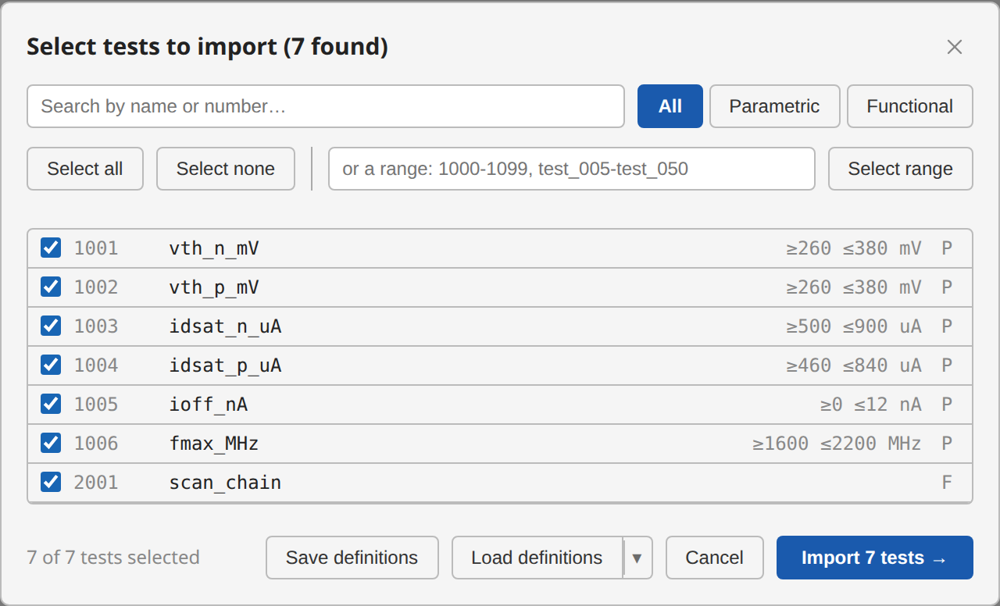
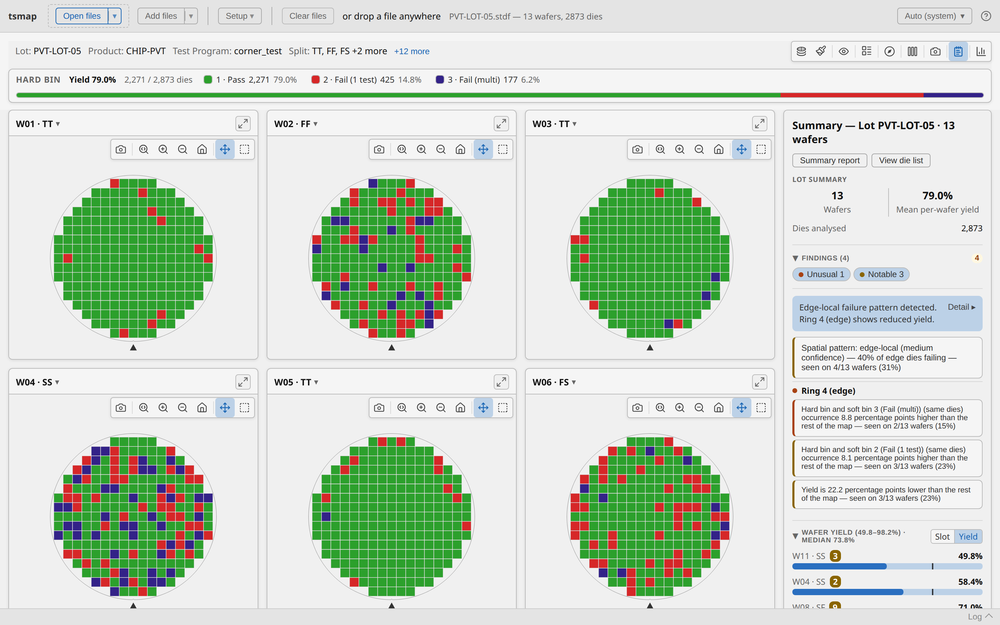

# Analyse your first wafer lot

**For:** anyone new to tsmap. No wafer files, no installation, and no prior knowledge of the
app needed.
**Goal:** load a real multi-wafer lot, find its worst wafer, and discover *why* it is the
worst.
**You will need:** a browser. Nothing else.
**Time:** about 10 minutes.

At the end you will have found a genuine process-corner effect in a 13-wafer lot, and you will
know which parts of the interface to reach for when you do it with your own data.

This is a guided walk-through with a known answer — follow it in order. For the full reference
on any screen it touches, see the [user guide](user-guide.md).

---

## 1. Open tsmap

Go to **[wafertools.github.io/tsmap/app/](https://wafertools.github.io/tsmap/app/)**.

The browser version needs no download and parses files entirely on your own machine — nothing
is uploaded. Everything below works identically in the
[desktop app](index.md) if you have it installed.

You should see an empty toolbar with **Open files**, **Add files**, and — in the middle of the
window — **Load sample data**.

## 2. Load the sample lot

Click **Load sample data**.

This loads `PVT-LOT-05`, a synthetic 13-wafer lot generated for demonstration — no real device
data. It is a *process-corner* lot: each wafer was run at a deliberately different corner of
the process window, and tsmap labels each one automatically.

## 3. Import the tests

A **test selector** appears before parsing. This happens for every STDF and ATDF file — it is
the import step, not a warning.

The lot has 7 tests (six parametric, one functional), and all of them are already ticked. Small
lots arrive pre-selected; a large one starts empty instead, so that "import everything" can
never be the accidental default. See
[Memory advisory](user-guide.md#memory-advisory) for where that line falls.

Click **Import 7 tests →**.

**You should now see** a grid of 13 wafer maps, each card titled like `W01 · TT`, with a
**Summary** panel down the right-hand side, headed *Lot PVT-LOT-05 · 13 wafers* — every wafer
comes from that one lot, so the panel names it. The `· TT` suffix is the process corner —
those were applied automatically along with the sample.

## 4. Read the lot summary

Before looking at any single wafer, read the panel on the right. It reports:

- **13 wafers**, **79.0 %** mean per-wafer yield, **2,873** dies analysed.
- A **Findings** section — 4 findings, 1 *Unusual* and 3 *Notable*.

The top finding reads **"Edge-local failure pattern detected. Ring 4 (edge) shows reduced
yield."** tsmap found that on its own: nothing was configured to look for it.

> **Mean per-wafer yield is not lot yield.** It is the arithmetic mean of 13 per-wafer
> percentages, so every wafer counts equally regardless of how many dies it has. The label
> says which one it is — worth reading carefully whenever you quote a number from here.

## 5. Find the worst wafer

Scroll to **Wafer Yield** at the bottom of the panel. It lists every wafer in **slot** order by
default. Click **Yield** on the small **Slot | Yield** toggle to re-sort worst-first.

The order is now:

| Wafer | Yield |
|-------|-------|
| W11 · SS | 49.8 % |
| W04 · SS | 58.4 % |
| W08 · SF | 71.0 % |
| W02 · FF | 71.9 % |
| … | … |
| W05 · TT | 94.6 % |
| W01 · TT | 95.5 % |

**This is the moment the lot explains itself.** The two worst wafers are both **SS**. The two
best are both **TT**. Yield is tracking the process corner, not the slot number — and slot
order, the default view, hides that completely.

## 6. Look at the worst wafer

Click the **⤢** expand icon on the `W11 · SS` card to open it on its own.

Use the **Plot mode** button in the toolbar to switch between **Hard Bin** and **Soft Bin**.
Hard bin tells you *whether* a die failed; soft bin tells you *how* — the same failures,
resolved into finer categories. Hover any die for its coordinates, bin, and test values.

Close the expanded view when you are done.

## 7. Compare the corners

Click **Insights** (the chart icon at the right of the gallery toolbar). You get three sub-tabs:
**Overview**, **Distributions**, and **Correlation**.

On **Overview**, find the **Group by:** picker and choose **Split**.

Every panel now reports per corner instead of per wafer. Yield by Split ranks the corners
directly, and the bin pareto shows *which* bins each corner is losing dies to — SS failing
differently from FF is a different problem from SS simply failing more.

Click a bar in **Yield by Split** to drill into that corner's individual wafers, then **← Back**
to return.

## 8. Export one result

Any of these work from the lot view:

- **Summary report** (top of the Summary panel) — a self-contained HTML report of the whole
  lot.
- **Test values CSV** / **Functional CSV** — the underlying numbers.
- **Download gallery PNG** (camera icon in the toolbar) — the wafer grid as an image.

## What you have done

- Loaded a 13-wafer lot and imported its tests.
- Read a lot-level summary and let tsmap surface an edge-related pattern unprompted.
- Re-sorted by yield and found that the worst wafers share a process corner.
- Switched between hard and soft bin to separate *whether* from *how*.
- Grouped the whole analysis by split to compare corners rather than wafers.
- Exported a result.

## Where to go next

- **Your own data** — [Supported file formats](user-guide.md#1-supported-file-formats) and, for
  CSV/JSON/Parquet, [Column mapping](user-guide.md#3-column-mapping-csv-json-and-parquet).
- **Splits on your own lots** — the sample's corners were pre-assigned; assign your own in
  [Wafer splits](user-guide.md#6-wafer-splits).
- **Something not working** — [Troubleshooting](troubleshooting.md).
- **The rest of the interface** — the [user guide](user-guide.md).
